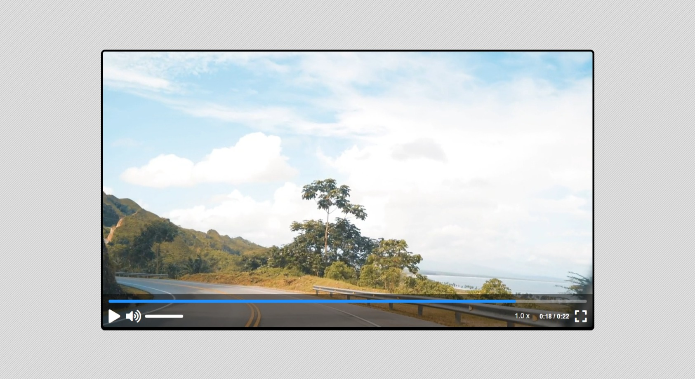

# #11

## Video Player
This project aims to create a custom video player using HTML, CSS and Vanilla JavaScript. The video player has basic functions such as playing, pausing, adjusting the volume, going full screen and fast-forwarding and rewinding the video.

## Screenshot
Here we have project screenshot :

