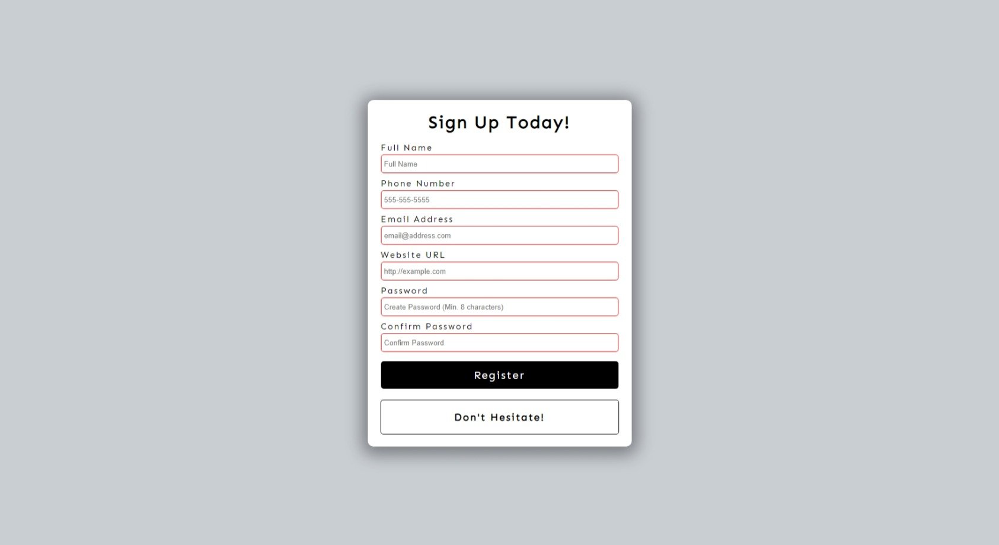

# Form Validation
This project aims to understand the functionality and style of a simple form validation using HTML, CSS and Vanilla JavaScript. Form validation checks whether the data entered by the user meets certain criteria. For example, the email field should contain a valid email address, the password field should be of a certain length and complexity, the username field should not be left blank.

## Screenshot
Here we have project screenshot :

