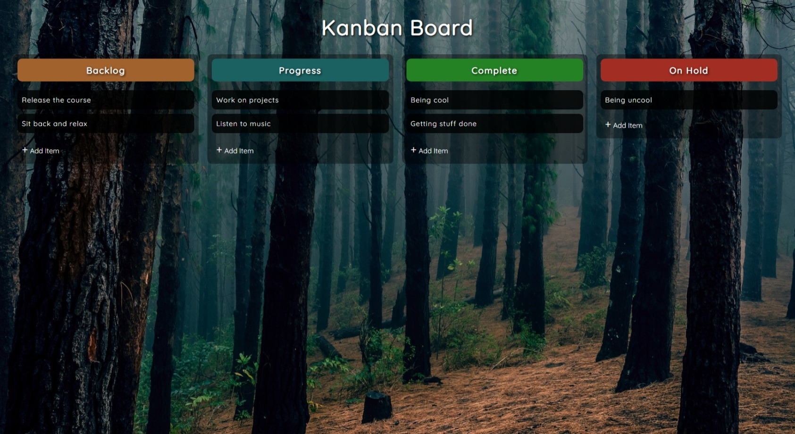

# Drag and Drop
This project shows how to make a Kanban board with drag and drop functionality using HTML, CSS, and JavaScript. A Kanban board allows you to organize tasks in different columns.

## Screenshot
Here we have project screenshot :

