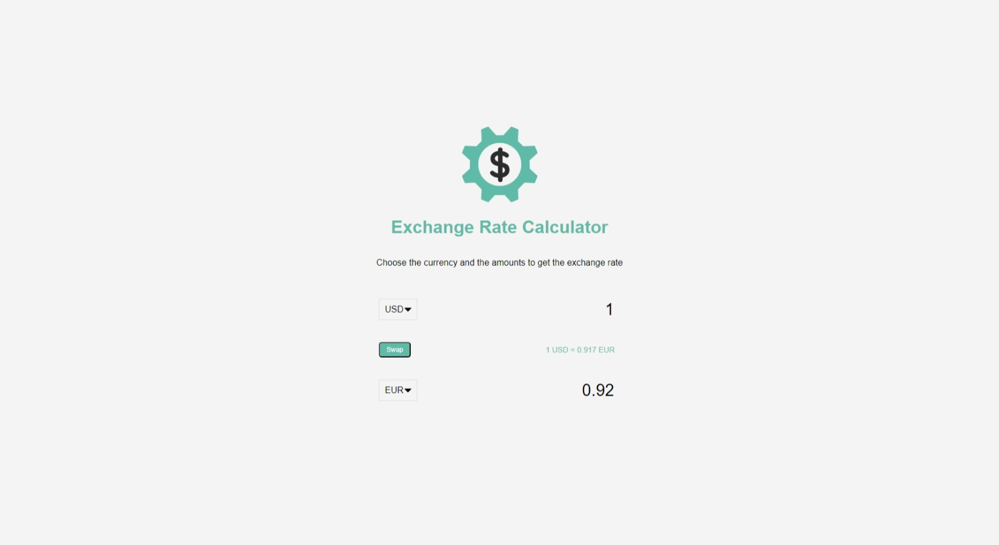

# #22

## Exchange Rate Calculator
Select countries to get the exchange rate for a specific amount, using the [Exchange Rate API](https://www.exchangerate-api.com/).

## Project Specifications

- Display UI with 2 select lists for countries and 2 inputs for amounts
- Fetch exchange rates from API
- Display the values for both countries
- Update values on amount change
- Swap country rates

## Screenshot
Here we have project screenshot :

