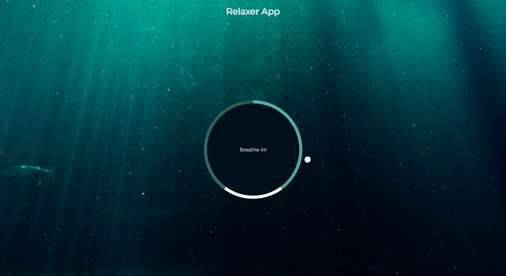

# #32

## Relaxer App
A relaxing breathing app with a visual director to tell you when to breathe in, hold and breathe out using CSS animations and JavaScript.

## Project Specifications
- Create circle and gradient circle with CSS
- Create and animate pointer (Small circle)
- Create grow and shrink animations
- Add JavaScript to create the breath animation effect

## Screenshot
Here we have project screenshot :

