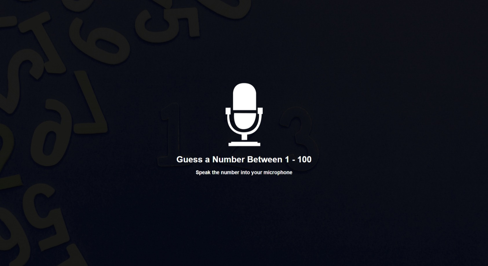

# #36

## Speak Number Guess
Number guessing game where you speak your guess into the microphone using the speech recognition API.

## Project Specifications
- Display UI directing user to speak guess
- Implement speech recognition to listen to mic
- Process user's guess and match
- Let user know higher, lower, match or not a number

## Screenshot
Here we have project screenshot :

