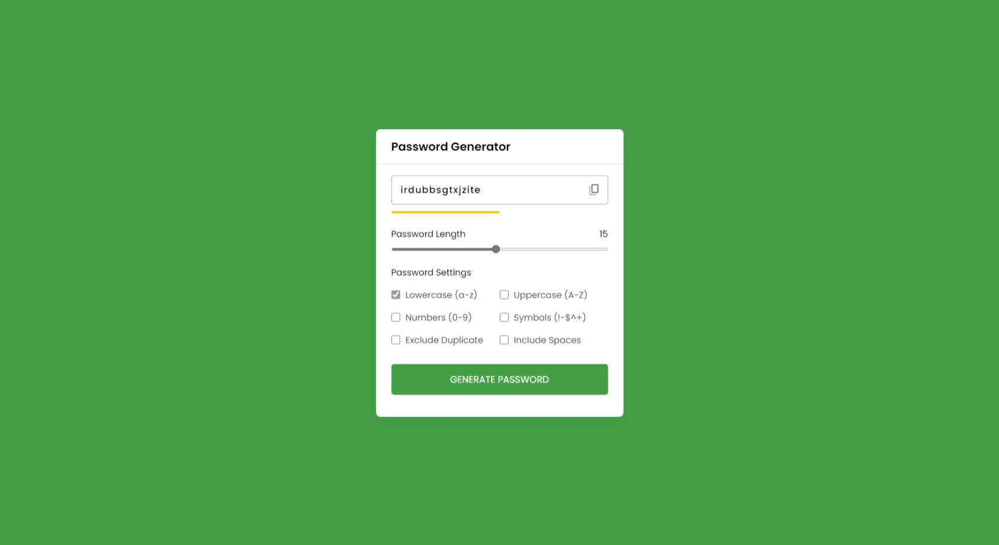

# #39

## Password Generator
This is a simple password generator app that uses Vanilla JavaScript. It allows the user to generate a random password based on the length and criteria they choose.

## Features
- The user can select the length of the password from 8 to 128 characters.
- The user can choose to include uppercase letters, lowercase letters, numbers and symbols in the password.
- The app will generate a random password that matches the user's preferences and display it on the screen.
- The user can copy the password to the clipboard by clicking the copy button.
- The user can generate a new password by clicking the generate button.

## Screenshot
Here we have project screenshot :

