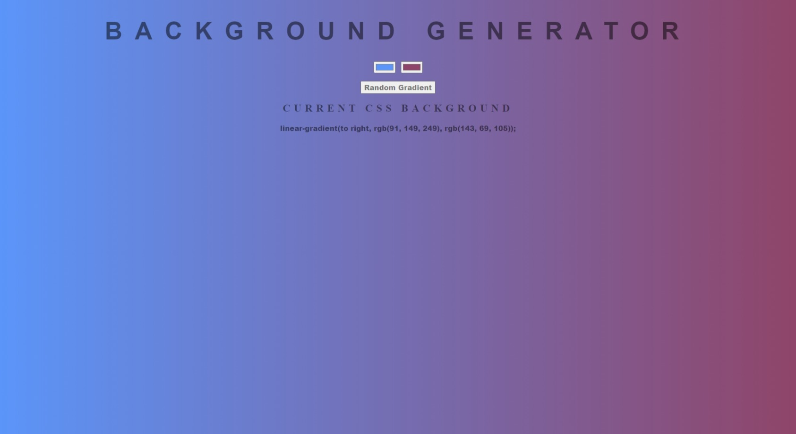

# #40

## Background Generator
This is a simple background generator app made with Vanilla JavaScript.

## Features
- The user can select two colors using the color picker.
- The app will generate a linear gradient background based on the colors the user chose and display the CSS code for the gradient on the screen.
- The user can copy the CSS code to the clipboard by clicking the copy button.
- The user can generate a new gradient by clicking the generate button.

## Screenshot
Here we have project screenshot :

