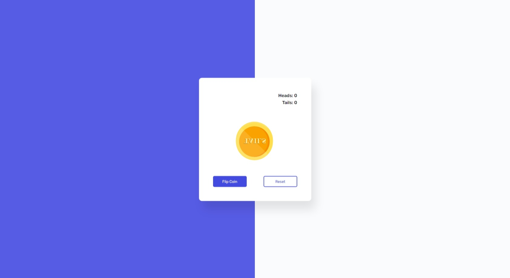

# #43

## Flip Coin Game
This is a simple flip coin game made with Vanilla JavaScript. 

## Features
- The user can flip a coin.
- The user can see the result of the coin flip.
- The user can see the number of heads and tails flipped.
- The user can reset the count of heads and tails flipped.

## Screenshot
Here we have project screenshot :

