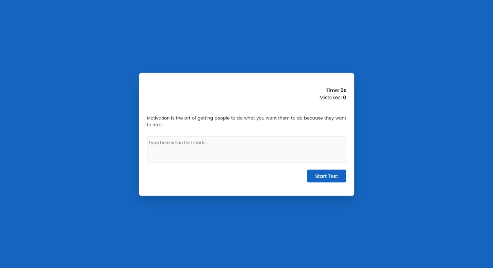

# Type Test App
This is a simple type test app made with Vanilla JavaScript. Using API from [Quotable](https://github.com/lukePeavey/quotable).

## Features
- The user can type a word.
- The user can see if the word is correct or not.
- The user can see the number of correct words typed.
- The user can see the number of incorrect words typed.
- The user can see the accuracy of the words typed.

## Screenshot
Here we have project screenshot :

