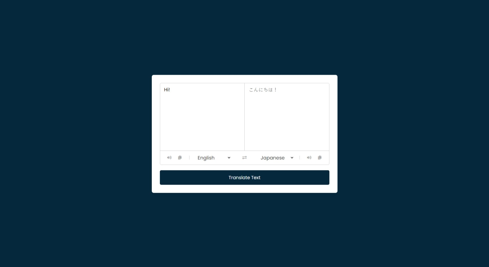

# Translator App
This is a simple translator app made with Vanilla JavaScript. Using API from [MyMemory](https://mymemory.translated.net/).

## Features
- The user can type a word.
- The user can see the translation of the word.

## Screenshot
Here we have project screenshot :

