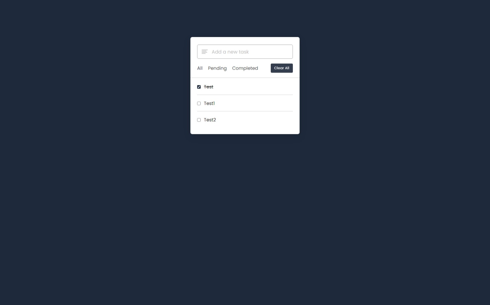
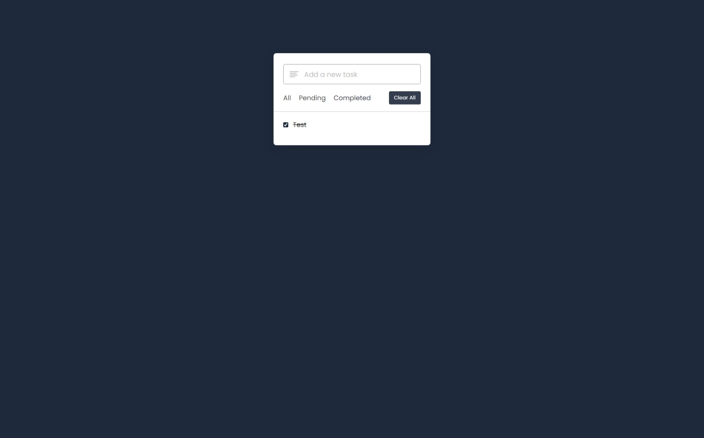
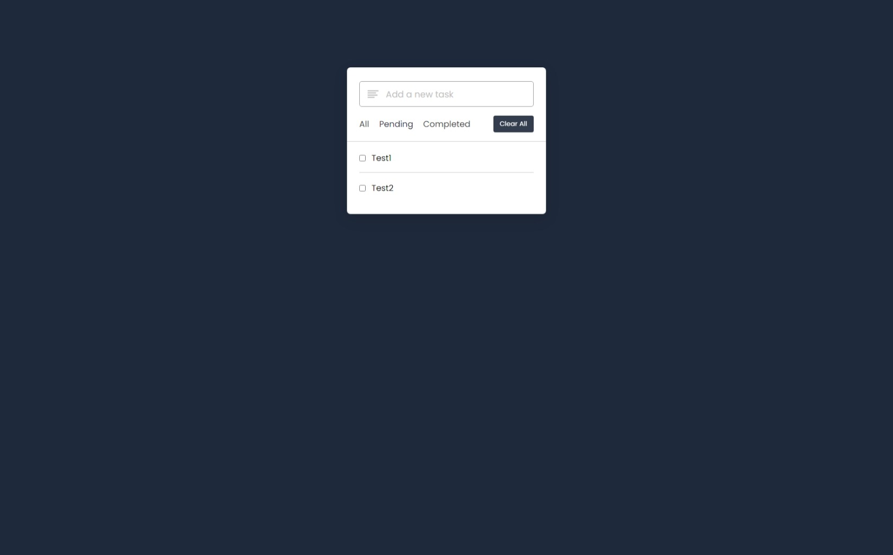

# #47

## Todo App
This is a simple todo app made with Vanilla JavaScript.

## Features
- The user can add a todo.
- The user can pending a todo.
- The user can see all todos.

## Screenshot
Here we have project screenshot :

